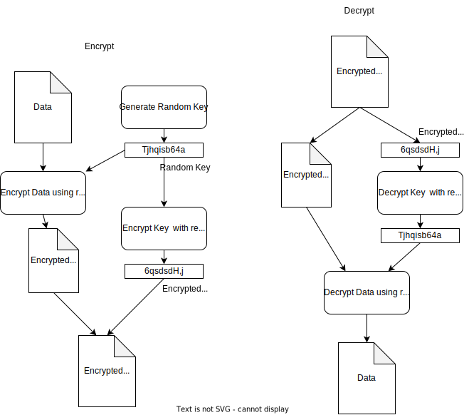

# GPG-PGP & sops

# PGP

~~~admonish tip title="gpg pgp differences"
- In short, GPG is a CLI tool that implements PGP
- PGP (Pretty Good Privacy) is an encryption program that provides cryptographic privacy and authentication for data communication. It can be used for signing, encrypting, and decrypting texts, e-mails, files...
- GPG, on the other hand, stands for GnuPG, which is a free implementation (a command line tool) of the OpenPGP standard, RFC4880. 

~~~

## GPG cli
Create a public and private key (and keyring + trustdb if not already present) in the current directory under .gnupg folder

```
gpg --gen-key --homedir .gnupg
```
You will be asked for somes info and a passphrase

~~~admonish example title="output" collapsible=true
gpg (GnuPG) 2.2.27; Copyright (C) 2021 Free Software Foundation, Inc.
This is free software: you are free to change and redistribute it.
There is NO WARRANTY, to the extent permitted by law.

gpg: directory '/home/user/rust/thoughts/.gnupg' created
gpg: keybox '/home/user/rust/thoughts/.gnupg/pubring.kbx' created
Note: Use "gpg --full-generate-key" for a full featured key generation dialog.

GnuPG needs to construct a user ID to identify your key.

Real name: jonsnow
Email address: jonsnow@stark.com
You selected this USER-ID:
    "jonsnow <jonsnow@stark.com>"

Change (N)ame, (E)mail, or (O)kay/(Q)uit? o  
We need to generate a lot of random bytes. It is a good idea to perform  
some other action (type on the keyboard, move the mouse, utilize the  
disks) during the prime generation; this gives the random number  
generator a better chance to gain enough entropy.  
gpg: /home/user/rust/thoughts/.gnupg/trustdb.gpg: trustdb created  
gpg: key 44F3DCD5924B36B0 marked as ultimately trusted  
gpg: directory '/home/user/rust/thoughts/.gnupg/openpgp-revocs.d' created  
gpg: revocation certificate stored as '/home/user/rust/thoughts/.gnupg/openpgp-revocs.d/  484DFB2278EABBF9CCE040F744F3DCD5924B36B0.rev'  
public and secret key created and signed.  

pub   rsa3072 2023-04-18 [SC] [expires: 2025-04-17]
      484DFB2278EABBF9CCE040F744F3DCD5924B36B0
uid                      jonsnow <jonsnow@stark.com>
sub   rsa3072 2023-04-18 [E] [expires: 2025-04-17]
~~~

Export private key ring
```
gpg --no-default-keyring --homedir .gnupg/ --export-secret-keys > ./.gnupg/secret_keys_ring.gpg
```

Export public key ring
```
gpg --no-default-keyring --homedir .gnupg/ --export > ./.gnupg/public_key_ring.gpg
```

list secret-keys id in keyring
```
gpg --no-default-keyring --homedir .gnupg/ --list-secret-keys --keyid-format LONG
```

output
```
/home/user/go/src/github.com/user/pgp-test/./.gnupg/pubring.kbx
----------------------------------------------------------------------
sec   rsa3072/840F06145BCC384E 2023-04-18 [SC] [expires: 2025-04-17]
      45E3IDIDIDIDC5D22144DF06145BCC384E.....
uid                 [ultimate] jonsnow <jonsnow@stark.com>
ssb   rsa3072/0A5EC7E2D68FF709 2023-04-18 [E] [expires: 2025-04-17]
```

Export as armored a specific secret key
```
gpg --no-default-keyring --homedir .gnupg/ --armor --export-secret-keys 45E3IDIDIDIDC5D22144DF06145BCC384E...
```

Export as armored a specific public key
```
gpg --no-default-keyring --homedir .gnupg/ --armor --export 45E3IDIDIDIDC5D22144DF06145BCC384E...
```

content of .gnupg folder
```
drwx------     - user 18 avril 11:26 openpgp-revocs.d
drwx------     - user 18 avril 11:26 private-keys-v1.d
.rw-rw-r--  1,7k user 18 avril 11:33 public_key_ring.gpg
.rw-rw-r--  2,0k user 18 avril 11:26 pubring.kbx
.rw-------    32 user 18 avril 11:26 pubring.kbx~
.rw-rw-r--  3,8k user 18 avril 11:32 secret_keys_ring.gpg
.rw-------  1,3k user 18 avril 11:26 trustdb.gpg

```
